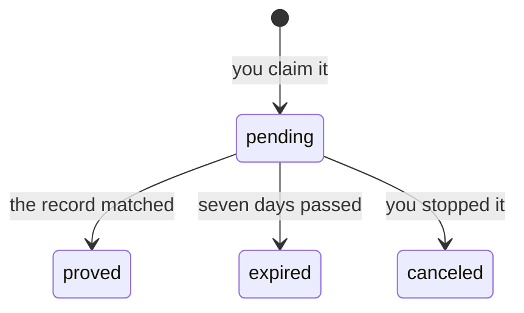

Each attempt at proving a domain is an episode with a beginning and an end. It opens when you claim
the name, and it ends one of three ways: **proved**, **expired** after seven days, or **cancelled**
because you stopped it.

An ended episode never moves again. Nothing re-checks it, its token stops being accepted, and it
stays in your history as a record of what happened.

Trying again is a new episode, with a new token.

## The states

`pending` is the only open state. The other three are ended, and ended is terminal — nothing
re-opens a claim and nothing re-checks one. Claiming the name again starts a separate claim next to
this one; it does not revive it.

In the API that last state is spelled `canceled`.

## The rules

| | `pending` | `proved` | `expired` | `canceled` |
|---|---|---|---|---|
| The token verifies | Yes | No | No | No |
| The record is on screen | Yes | No | No | No |
| A check can be run | Yes | No | No | No |
| A proof link can be published | No | Yes | No | No |
| Claiming the domain opens a new claim | No | Yes | Yes | Yes |

Four invariants hold behind that table, and the rest of this page is why.

- **One open claim per domain.** Claiming a name you already have open hands back the claim you
  hold, with its original token, rather than minting a second one — that is
  [`already_claimed`](/errors#already_claimed), and it is about your own account, not a conflict
  with anyone else's.
- **The window is fixed when the claim opens.** Seven days from that moment, not from your last
  check. Running more checks does not extend it and does not shorten it.
- **An ended claim takes no action.** Cancelling, proving or re-running a finished claim is
  [`claim_ended`](/errors#claim_ended). Claim the domain again instead.
- **Only an open claim has a record to show.** The moment a claim ends, ownsi stops publishing the
  TXT record for it, because that value no longer verifies anything.

## Why it expires at all

The proof reads *"on 15 June, this account demonstrated control of `acme.com`"*, and that sentence
is only worth anything if the demonstration was recent.

A token that stayed valid forever would break it. A record written in January and never cleaned up
would keep minting fresh proofs long after the domain had changed hands — and every one of those
proofs would be a lie told with a straight face.

So the window closes, and everything else follows:

- An ended claim's token is inert. The record left in your zone stops meaning anything.
- There is no *check this again* button on a finished episode. A new date needs a new demonstration.
- Seven days is chosen so nobody who did the work correctly loses it. Negative caching rarely
  exceeds a day; providers publish in minutes to hours.

<Note>
  Expiring is not an accusation. Not proving is never evidence against anyone — it can be a holiday,
  a broken provider, or our own failure.
</Note>

## Starting again is one edit, not a fresh start

Claim the domain again and you get a new token. The record you left in your zone still holds the old
one — and ownsi says exactly that rather than reporting that nothing was found:

> The token at `_ownsi-challenge.acme.com` is from an earlier claim. Change its value to the new
> token; the record is already in the right place.

That is [`expired_token`](/diagnostics/catalogue#expired_token), and it is the cheapest failure in
the catalogue. It is also the reason nobody should tell you to delete the record when you are done.

## Archiving is not deleting

Archiving takes a domain off your list. It ends whatever claim was open on it, and it takes back
every public link published from it — those slugs stop resolving, for good.

<Check>
  Every proof keeps its date and its state. Archiving retracts no proof; it stops publishing one.
</Check>

It is a fact about you and that name — "I am not working on this any more" — rather than something
that happens to a proof. That is why it can sit next to a proof without contradicting it.

An archived domain leaves the list without leaving the account. It waits on its own shelf —
`GET /api/domains?archived=true`, and the tab of the same name in the dashboard — carrying every
claim it ever held and every link it ever published, revoked ones included. What was shared is
still part of the record. Naming it (`GET /api/domains?name=…`) finds it either way.

Because it is off the list, it opens no new claim and publishes no new link: both answer
[`domain_archived`](/errors#domain_archived). Put it back with `POST /api/domains/{id}/unarchive`
and act from there — that is one act, not a side effect of the other. Putting it back restores no
old slug: a revoked link is revoked permanently, here as anywhere else.

Deleting is the other thing, and it is the only eraser: the domain, its claims and its links all go,
permanently.

## When the domain changes hands

Selling a domain asks nothing of you. Nothing has to be cancelled, cleaned up or handed over, and
the reason is the sentence the proof makes: it is dated, and it never said you control the name
today.

Four things people expect to owe, and what each one actually does:

| | |
|---|---|
| **Delete the TXT record** | Not needed. Nothing has depended on it since the day you were proved, and the token is not a credential — it grants whoever finds it nothing at all. Leave it and it travels with the zone; delete it and nothing changes. |
| **Archive the domain** | The tidiest of the four, and the one with a consequence. It ends a claim still open, takes the domain off your list, and takes back every link you published from it — those addresses stop resolving. Every proof keeps its date and its state. |
| **Take your links back** | Worth a thought. A published link keeps resolving, and what it states is still true — a date that has already passed. Revoke it if you would rather it stopped circulating. |
| **Tell the buyer something** | No. They claim the name on their own account, get their own token and earn their own proof. |

<Note>
  You are not told when the new owner proves it. That email reaches accounts with a claim still
  **open** on the name, and yours ended the day it was proved.
</Note>

Sold with a claim still open? That needs nothing either — the window closes on its own at the end
of the seven days. Cancelling is the tidier version of the same outcome.

### Handing it over on purpose

There is no transfer action, and there is nothing to transfer. A proof names the account that
demonstrated control on a date, so moving it to somebody else would make it say a thing that never
happened. What a handover really is: you end your side, and the new owner earns theirs.

<Steps>
  <Step title="Point the buyer at the name">
    They add it on their own account, get their own token and create their own record. Nothing from
    you is needed — claiming a domain has never asked permission from whoever held it before, and
    your token would prove them nothing anyway.
  </Step>
  <Step title="Archive it once you are done with it">
    That ends a claim still open and takes back every link you published from the name. Leave it
    until last: revoking is permanent, and putting the domain back on the list does not bring the
    old addresses back.
  </Step>
</Steps>

What you end up with is two proofs and two dates, both true — the same coexistence two colleagues
get. Yours says you controlled the zone up to the day you sold it. Theirs starts the day they took
over. Neither sentence needs the other to be false.

## When someone else proves the same domain

Two accounts can each prove the same domain, and often should — two people at the same company both
control the zone. Both created the record, both were verified, and neither has more right to the
name than the other.

Nothing is taken away from anyone. Both proofs stand.

If you have a claim **open** on the name when somebody else proves it, an email tells you so. It
names the domain and nothing about the other account — at that point you have not demonstrated
anything yourself.

Once you are proved too, your domain lists who else holds one: each address with its local part
masked — `m•••@acme.com` — and the date they proved it. Enough to recognise a colleague, not enough
to harvest an address.

### If it was not you

Two proofs of one name are usually two colleagues. But a proof is a demonstration that somebody
could write to the zone, so if nobody else should have been able to, that is what the second one is
telling you.

Ownsi will not retract the other proof, and says so plainly rather than offering a button that
pretends to: there is no way to make a past moment untrue. What it gives you instead is the date,
and the date is where to start. Check who held access to your DNS that day — registrar logins,
provider API tokens, and anyone with delegated access to the zone.

<Note>
  Claiming a domain that already has a claim **open on your own account** is a different thing, and
  ownsi will not issue a second token behind your back. It hands you back the claim you already
  have, with its original token.
</Note>

## The dates on a proved domain

Two, and they are read across every claim you have made on the name:

| | |
|---|---|
| **First proved** | the earliest proof you ever earned on this domain |
| **Most recently confirmed** | the latest one |

Neither is stored anywhere, which is why neither can drift out of step with the claims behind it.
They only ever move forwards.
